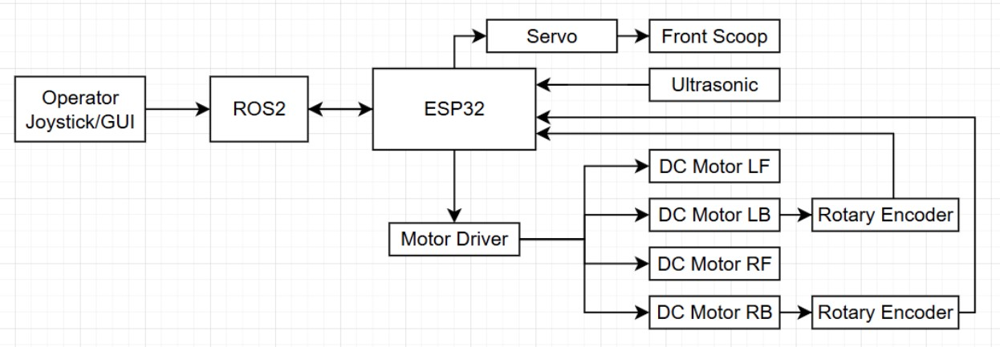
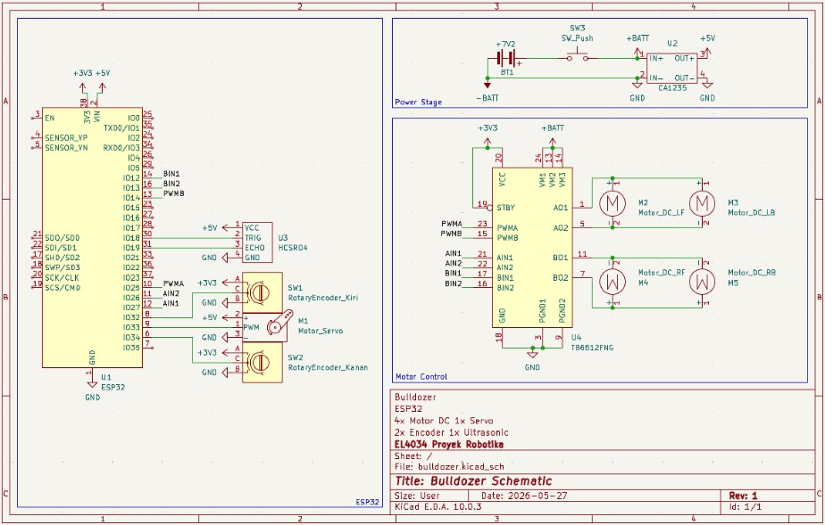
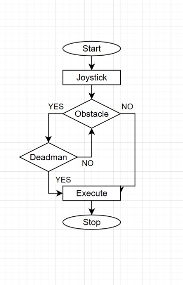
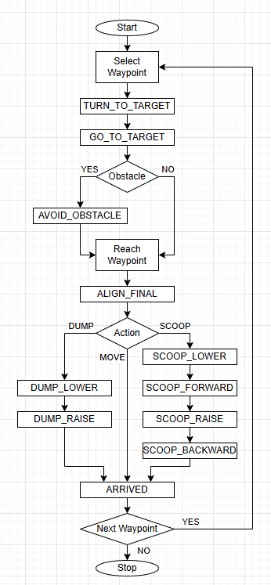
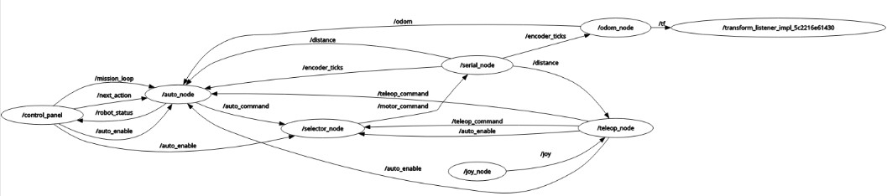
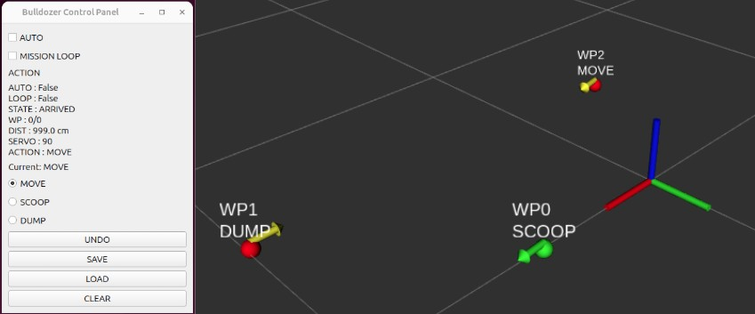

# Bulldozer Robot

ROS2 Jazzy mobile robot developed using ESP32 and a differential drive architecture. The project supports manual teleoperation, waypoint-based autonomous navigation, wheel odometry, obstacle avoidance, and scoop/dump task execution.

## Overview

This project was developed as part of a robotics course project. The robot uses ESP32 for low-level motor and sensor control, while ROS2 handles high-level control, localization, visualization, and autonomous behaviors.

### Main Features

- Differential drive mobile robot
- ESP32-based motor and servo controller
- Rotary encoder wheel odometry
- ROS2 odometry publisher
- TF transform publisher
- RViz2 visualization
- Goal-based autonomous navigation
- Obstacle avoidance using ultrasonic sensor
- Scoop and dump task execution
- Manual teleoperation mode
- UDP communication between ROS2 and ESP32

---

## System Architecture



The robot consists of an ESP32 controller connected to four DC motors, rotary encoders, an ultrasonic sensor, and a bucket servo mechanism. ROS2 communicates with the ESP32 and provides visualization and autonomous control functions.

---

## Hardware Schematic



Hardware platform:
- ESP32
- TB6612FNG Motor Driver
- 4 DC Motors
- 2 Rotary Encoders
- HC-SR04 Ultrasonic Sensor
- Servo Motor

---

## Manual Control Logic



Manual mode uses joystick commands while continuously checking obstacle conditions and deadman safety logic before executing movement commands.

---

## Autonomous Navigation Logic



The autonomous mode performs:

1. Waypoint selection
2. Heading alignment
3. Target tracking
4. Obstacle avoidance
5. Final alignment
6. Scoop or dump task execution
7. Waypoint progression

---

## ROS2 Architecture and Visualization




ROS2 nodes include:

- `auto_node`
- `odom_node`
- `serial_node`
- `selector_node`
- `teleop_node`
- `joy_node`

The system publishes wheel odometry and TF transforms for robot localization and RViz2 visualization.

---

## Repository Structure

```text
bulldozer-robot
│
├── esp32_firmware
│   ├── src
│   ├── include
│   ├── lib
│   ├── test
│   └── platformio.ini
│
├── ros2_packages
│   ├── bulldozer_control
│   ├── bulldozer_interfaces
│   └── bulldozer_gui
│
├── docs
│   ├── system_architecture.png
│   ├── manual_control_flowchart.png
│   ├── autonomous_navigation_flowchart.png
│   ├── hardware_schematic.png
│   └── ros2_graph_and_rviz.png
│
└── README.md
```

---

## Build and Run

```bash
cd ~/ros2_ws

colcon build

source install/setup.bash

ros2 launch bulldozer_control bulldozer.launch.py
```

---

## Configurable Parameters

### Navigation Parameters (auto_node)

| Parameter | Description |
|------------|------------|
| turn_pwm | Turning speed |
| drive_pwm | Forward driving speed |
| servo_angle | Bucket servo angle |
| BUCKET_DUMP | Dump position |
| BUCKET_CARRY | Carry position |
| arrive_tolerance | Waypoint arrival threshold |
| heading_tolerance | Heading alignment threshold |
| realign_tolerance | Final alignment threshold |
| obstacle_threshold | Obstacle detection threshold |

### Odometry Parameters (odom_node)

| Parameter | Description |
|------------|------------|
| wheel_diameter | Wheel diameter |
| wheel_base | Distance between wheels |
| ticks_per_rev | Encoder resolution |
| max_tick_jump | Encoder spike rejection threshold |

### Communication Parameters (serial_node)

| Parameter | Description |
|------------|------------|
| esp32_ip | ESP32 IP address |
| udp_port | UDP communication port |

### ESP32 WiFi Parameters

| Parameter | Description |
|------------|------------|
| ssid | WiFi SSID |
| password | WiFi password |

---

## Technologies Used

### Robotics
- ROS2 Jazzy
- RViz2

### Embedded Systems
- ESP32
- PlatformIO
- C++

### Software
- Python
- UDP Communication

### Hardware
- Rotary Encoder
- HC-SR04 Ultrasonic Sensor
- Servo Motor
- TB6612FNG Motor Driver

### Design Tools
- KiCad

---

## Future Improvements

- IMU integration for improved localization
- SLAM and mapping capabilities
- Nav2 integration
- Improved obstacle avoidance
- Hardware PCB implementation
